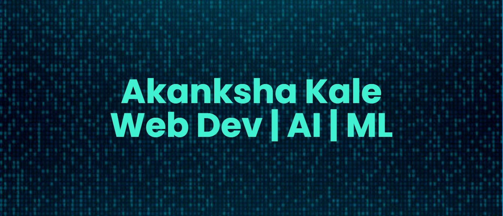

  

Hello👋! I'm Akanksha Kale, currently a Junior at MKSSS's Cummins College of Engineering For Women.
 
I enjoy participating in hackathons and contributing to Open Source Projects.
 
I have a strong interest in Web development and AI/ML. 

<h3 align="left">Connect with me:</h3>

<h3 align="left">Languages and Tools:</h3>

 
 
 
   
 
 
 
 
 
  

[![@akanksha1131's's Holopin board] (https://holopin.io/api/user/board?user=akanksha1131)](https://holopin.io/@akanksha1131)

  

  

<a> 
    
  
   
</a>

